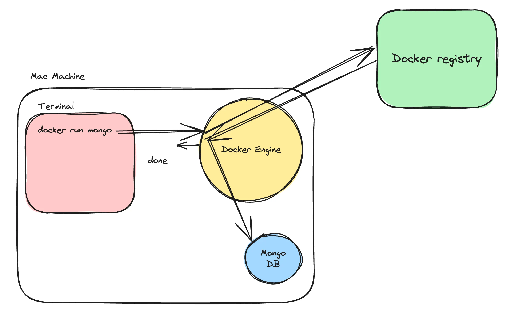
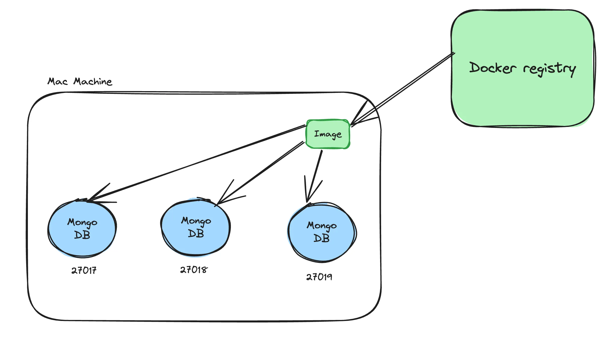
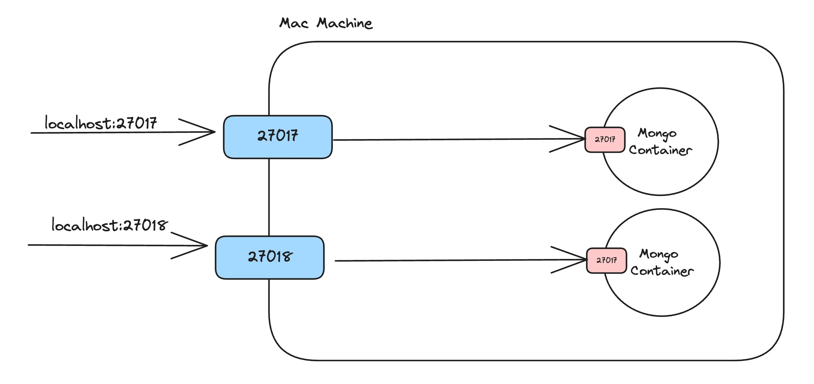

# Virtual machine
Acts like a full computer
Has its own operating system
Heavy and slow to start

# Container
Acts like a single application
Uses the same operating system as the host
Very light and starts fast

# VM runs an OS, container runs an app.

VM = Renting a whole house 🏠
Container = Renting one room 🛏️

VM → Computer inside a computer
Container → App inside a computer

Containers uses
which are used to run code in isolated environment.
starting projects /auxillary (postgress ,mongodb,..etc)services locally 

Containers are a way to package and distribute software applications in a way that makes them easy to deploy and run consistently across different environments. They allow you to package an application, along with all its dependencies and libraries, into a single unit that can be run on any machine with a container runtime, such as Docker.

A container is the box that holds:
Your app
Libraries
Dependencies
Settings

* why containers
* let's you describe your configuration in a single file.
* can run in a isolated env's.
* makes local set up's a breeze.
* makes installing auxillary servicesand db's easy.

Docker is a tool that helps you create, run, and manage containers easily.

Dockerfile → Image → Container
container is a running instance of an image.
**
docker run -d -p 27017:27017 mongo  --> is a command used to run mongodb locaaly -->Runs MongoDB inside a Docker container, but makes it accessible on your local machine.

work flow

3 main thins

Docker engine  ---> The core service that actually runs containers on your machine.
Docker registry ---> A storage place where Docker images are saved and downloaded from.
Docker cli   ------> The command-line tool you type commands into (docker run, docker pull).which will talk with docke engine.

Docker Hub :

A specific registry provided by Docker.
Public by default
Free & paid plans
Most popular registry
Docker Hub = one example of a registry

diffrence between img vs cntr

docker images  -->used to check what all iamges were present.
docker ps      -->used to check what all containers were present.

Port mapping 

docker run -d -p 27018:27017 mongo
-p <HOST_PORT> : <CONTAINER_PORT>
Container port = the port the app INSIDE the container is listening on
Each Docker image usually has a default port because the application inside it listens on that port.

docker run -d -p 27017:3000 mongo
What Docker thinks:
    Host port → 27017
    Container port → 3000
Reality:
    MongoDB listens on 27017
    NOTHING is listening on 3000 inside the container

Result:
❌ Connection refused
❌ MongoDB not reachable

1. docker images
Shows you all the images that you have on your machine
2. docker ps
Shows you all the containers you are running on your machine
3. docker run
Lets you start a container

    -p ⇒ let’s you create a port mapping
    -d. ⇒ Let’s you run it in detatched mode

4. docker build
Lets you build an image. We will see this after we understand how to create your own Dockerfile
5. docker push
Lets you push your image to a registry
6. Extra commands
    docker kill ---> used to kill containers.
    docker exec ----> lets you run a command inside a running container.
    docker rmi img_name --->used to remove image.   

# What is a Dockerfile
If you want to create an image from your own code, that you can push to dockerhub, you need to create a Dockerfile for your application.
A Dockerfile is a text document that contains all the commands a user could call on the command line to create an image.

# How to write a dockerfile
A dockerfile has 2 parts
    Base image
    Bunch of commands that you run on the base image (to install dependencies like Node.js)

    

FROM node:16-alpine
# Uses Node.js image as base (gives OS + Node)
WORKDIR /app
# Sets /app as the current working folder inside container
COPY . .
# Copies all files from current build folder (host) to /app (container)
RUN npm install
# Installs dependencies while building the image
RUN npm run build
# Builds the application during image creation
EXPOSE 3000
# Documents that app runs on port 3000
CMD ["node", "dist/index.js"]
# Starts the app when container runs

## Golden rule to remember.
RUN  → runs while building image
CMD  → runs when container starts

now command build the iamge 

# docker build -t "name" .
 t reapresent tag.
 . means: use the files in this folder as input to create the core part of the image and install everything needed using those files while building the image.

 # passing env 
 docker run -p 3000:3000 -e DATABASE_URL="" image_name

 1.can we create a container inside a container ?

 exec command 

 docker exec -it c-id /bin/bash