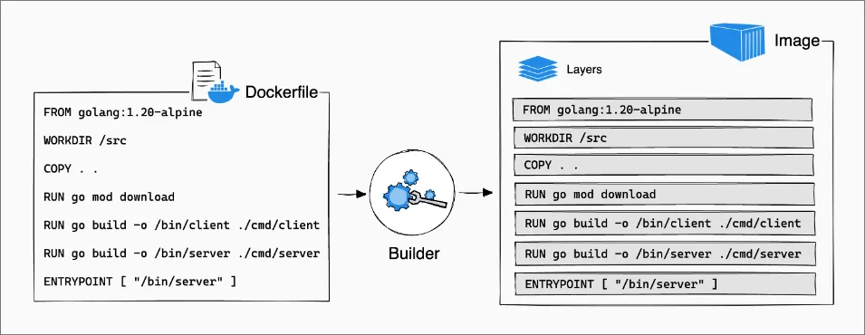
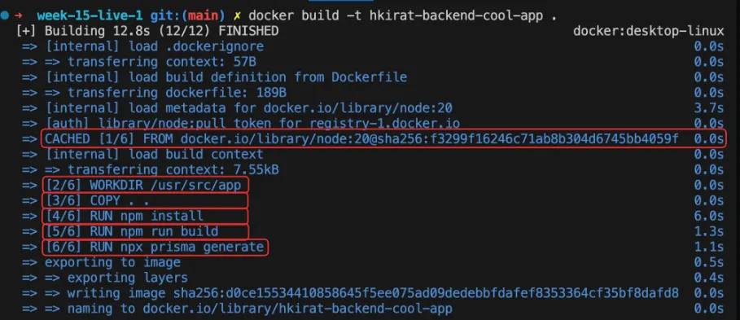
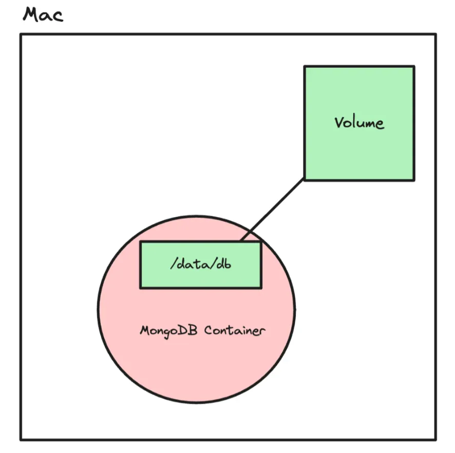
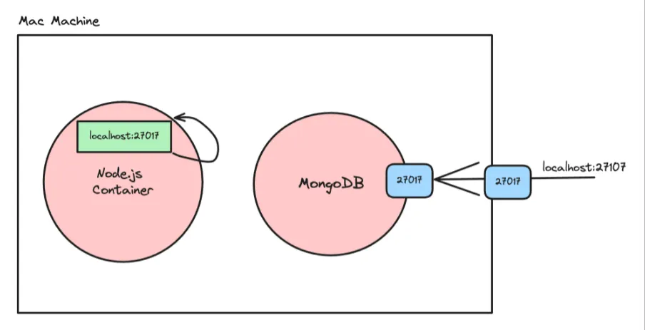
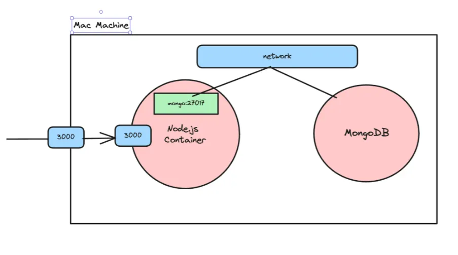
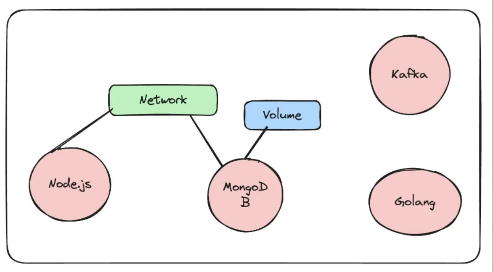

# Virtual machine
Acts like a full computer
Has its own operating system
Heavy and slow to start

# Container
Acts like a single application
Uses the same operating system as the host
Very light and starts fast

# VM runs an OS, container runs an app.

VM = Renting a whole house 🏠
Container = Renting one room 🛏️

VM → Computer inside a computer
Container → App inside a computer

Containers uses
which are used to run code in isolated environment.
starting projects /auxillary (postgress ,mongodb,..etc)services locally 

Containers are a way to package and distribute software applications in a way that makes them easy to deploy and run consistently across different environments. They allow you to package an application, along with all its dependencies and libraries, into a single unit that can be run on any machine with a container runtime, such as Docker.

A container is the box that holds:
Your app
Libraries
Dependencies
Settings

* why containers
* let's you describe your configuration in a single file.
* can run in a isolated env's.
* makes local set up's a breeze.
* makes installing auxillary servicesand db's easy.

Docker is a tool that helps you create, run, and manage containers easily.

Dockerfile → Image → Container
container is a running instance of an image.
**
docker run -d -p 27017:27017 mongo  --> is a command used to run mongodb locaaly -->Runs MongoDB inside a Docker container, but makes it accessible on your local machine.

work flow

3 main thins

Docker engine  ---> The core service that actually runs containers on your machine.
Docker registry ---> A storage place where Docker images are saved and downloaded from.
Docker cli   ------> The command-line tool you type commands into (docker run, docker pull).which will talk with docke engine.

Docker Hub :

A specific registry provided by Docker.
Public by default
Free & paid plans
Most popular registry
Docker Hub = one example of a registry

diffrence between img vs cntr

docker images  -->used to check what all iamges were present.
docker ps      -->used to check what all containers were present.

Port mapping 

docker run -d -p 27018:27017 mongo
-p <HOST_PORT> : <CONTAINER_PORT>
Container port = the port the app INSIDE the container is listening on
Each Docker image usually has a default port because the application inside it listens on that port.

docker run -d -p 27017:3000 mongo
What Docker thinks:
    Host port → 27017
    Container port → 3000
Reality:
    MongoDB listens on 27017
    NOTHING is listening on 3000 inside the container

Result:
❌ Connection refused
❌ MongoDB not reachable

1. docker images
Shows you all the images that you have on your machine
2. docker ps
Shows you all the containers you are running on your machine
3. docker run
Lets you start a container

    -p ⇒ let’s you create a port mapping
    -d. ⇒ Let’s you run it in detatched mode

4. docker build
Lets you build an image. We will see this after we understand how to create your own Dockerfile
5. docker push
Lets you push your image to a registry
6. Extra commands
    docker kill ---> used to kill containers.
    docker exec ----> lets you run a command inside a running container.
    docker rmi img_name --->used to remove image.   

# What is a Dockerfile
If you want to create an image from your own code, that you can push to dockerhub, you need to create a Dockerfile for your application.
A Dockerfile is a text document that contains all the commands a user could call on the command line to create an image.

# How to write a dockerfile
A dockerfile has 2 parts
    Base image
    Bunch of commands that you run on the base image (to install dependencies like Node.js)

    

FROM node:16-alpine
# Uses Node.js image as base (gives OS + Node)
WORKDIR /app
# Sets /app as the current working folder inside container
COPY . .
# Copies all files from current build folder (host) to /app (container)
RUN npm install
# Installs dependencies while building the image
RUN npm run build
# Builds the application during image creation
EXPOSE 3000
# Documents that app runs on port 3000
CMD ["node", "dist/index.js"]
# Starts the app when container runs

## Golden rule to remember.
RUN  → runs while building image
CMD  → runs when container starts

now command build the iamge 

# docker build -t "name" .
 t reapresent tag.
 . means: use the files in this folder as input to create the core part of the image and install everything needed using those files while building the image.

 # passing env 
 docker run -p 3000:3000 -e DATABASE_URL="" image_name

 1.can we create a container inside a container ?

 exec command 

 docker exec -it c-id /bin/bash

 # layers in docker.
 In Docker, layers are a fundamental part of the image architecture. A Docker image is essentially built up from a series of layers, each representing a set of differences from the previous layer. These layers are stacked on top of each other, forming the complete image.

 How Layers are Made
# Base Layer:
The base layer is the starting point of an image, typically an operating system (OS) like Ubuntu, Alpine, or any other base image specified in a Dockerfile. This base layer provides the foundation for the subsequent layers.
# Instruction Layers:
Each instruction in a Dockerfile creates a new layer in the image. These instructions include commands like RUN, COPY, ENV, and others, which modify the filesystem by installing packages, copying files from the host to the container, setting environment variables, or making other changes. Each of these modifications creates a new layer on top of the previous layer.
# Reusable and Shareable:
Layers are cached and reusable across different images, which makes building and sharing images more efficient. If multiple images are built from the same base image or share common instructions, they can reuse the same layers, reducing storage space and speeding up image downloads and builds.
# Immutable:
Once a layer is created, it cannot be changed. If a change is made, Docker creates a new layer that captures the difference. This immutability is key to Docker's reliability and performance, as unchanged layers can be shared across images and containers.

# Benefits of Layers
The layered architecture of Docker images provides several benefits:
Efficient Storage: By reusing and sharing layers across images, Docker can significantly reduce the storage space required for multiple images, as only the unique layers need to be stored.
# Faster Image Builds: 
When building an image, Docker can reuse cached layers from previous builds, reducing the time and resources required for subsequent builds.
Faster Image Distribution: Since layers are shareable, Docker only needs to transfer the unique layers when distributing an image, resulting in faster image downloads and deployments.
# Version Control: 
Each layer represents a specific set of changes, making it easier to track and roll back changes if necessary.
Portability: Docker images are portable across different environments and platforms because they encapsulate all the necessary dependencies and configurations within their layers.

# Base Image Layer:
The first layer is created from the base image specified in the FROM instruction. In this case, it's node:18-alpine, which is a lightweight Alpine Linux image with Node.js pre-installed. This layer serves as the foundation for the subsequent layers.
# WORKDIR Layer: 
The WORKDIR instruction sets the working directory for the subsequent instructions in the Dockerfile. It creates a new layer on top of the base image layer. In this example, the working directory is set to /app.
# COPY Layer: 
The COPY instruction is used twice in the Dockerfile. Each COPY instruction creates a new layer that adds files from the host system to the image filesystem.
The first COPY instruction copies the package.json file to the working directory (/app).
The second COPY instruction copies the rest of the application files (.) to the working directory.
 # RUN Layer: 
The RUN instruction executes a command inside the image and creates a new layer with the results. In this case, RUN npm install installs the dependencies specified in the package.json file, creating a new layer with the installed packages.
# CMD Layer: 
The CMD instruction specifies the default command to run when a container is started from the image. It doesn't create a new layer but rather sets the metadata for the image. In this example, CMD ["node", "index.js"] sets the command to run the index.js file using Node.js.

# Layer Caching: 
Docker caches layers to speed up subsequent builds. If a layer hasn't changed since the last build, Docker reuses the cached layer instead of rebuilding it. In the build logs, you can see CACHED next to the WORKDIR instruction, indicating that the layer was reused from the cache.
 

 # note : 
 Transitory means something that lasts only for a short time and then passes away

# Volumes
Volumes in Docker provide a way to persist data generated by containers and ensure that the data survives container restarts. Let's explore how volumes work and how they can be used to persist data in a MongoDB container.

# Without Volumes
By default, when you run a MongoDB container without specifying a volume, the data stored inside the container is lost when the container is stopped or restarted. Here's an example:

# With Volumes
To persist data across container restarts, you can use Docker volumes. Volumes are managed by Docker and provide a way to store data outside the container's filesystem. Here's how you can use volumes with a MongoDB container:

# command to create volume
docker volume create volume_database
# 1.then after the mount the folder in mongo/psql/mysql ..etc which actually stores the data to this volume.
docker run -v volume_database:/data/db -p 27017:27017 -d mongo
# command to check all the volumes which were present 
 docker volume ls 

 # command to run command in cli
 docker exec -it c_id /bin/bash

# now add some data inside (ex via mongo db)
docker exec -it tender_feistel mongosh

use testdb
db.users.insertOne({ name: "Jagadeesh", role: "DevOps" })
db.users.find()

now stop or remove  the container and then turn on again the same contanier it will persist that data.

# Where is the Docker volume physically stored?

docker volume inspect volume_database
You’ll see something like:"Mountpoint": "/var/lib/docker/volumes/volume_database/_data"

# Note
bid mount: You connect a real folder from your computer directly into the container.
ex : docker run -v /home/user/data:/app/data ubuntu
So if you:
Create a file on your laptop → it appears inside container
Create a file inside container → it appears on your laptop
# it’s like sharing a folder between your PC and Docker

A volume means: 
Docker creates and manages its own private storage space.

# This means:
Data is stored in Docker’s system
Not directly visible in your project folder
Safer and cleaner

Note :
you can connect diffrent containers to same voulme and they both can share data as well.

By using volumes, you can ensure that important data generated by containers is stored separately from the container's filesystem. This allows the data to survive container restarts and enables data persistence across different container instances.

The volume itself does NOT “travel” to production.
In production, you create a new volume on the production server, and the app uses that volume.

Data is environment-specific:
Your laptop volume → only for your laptop
Production server volume → only for production server
Think of it like this (real-world analogy)

Your laptop:
App (image)
MongoDB container
Volume (data stored locally)
Production server (AWS / EC2 / VPS / Kubernetes):
Same app image (pulled from Docker Hub)

MongoDB container
New volume created on that server
The app works the same way, but the data is stored separately.

Example: What happens in production
You build and push image:
docker build -t jaggi/my-backend .
docker push jaggi/my-backend

On production server:
docker pull jaggi/my-backend
docker volume create mongo_prod_data

docker run -v mongo_prod_data:/data/db -p 27017:27017 -d mongo
docker run -p 3000:3000 jaggi/my-backend

# Now:
Your backend runs in production
Mongo uses a production volume
Data persists across restarts
No need to bring your laptop volume.
Then how does real data appear in production?

# Because:
Real users start using your app
They create accounts
They add posts
They upload data
That data is stored in the production volume.
But what if you want to migrate data?
Then you do data migration, not volume migration.

# Examples:
MongoDB dump from old server → restore to new server
MySQL export → import
Cloud database migration

# Networks 
A way for containers to talk to each other and to the outside world (internet, your laptop, etc.)
Just like:
Phones need mobile network to call
Computers need Wi-Fi to connect
Containers need a network to communicate.

Without network, containers are isolated

# Each container is like a small computer:
# must be same network to start a connection.
Own IP
Own processes
Own filesystem
They cannot see each other unless connected to the same network

# command to create a netwok 
docker network create my_custom_network
# Tha abive  command creates a new Docker network named my_custom_network.
# Start the MongoDB container on the same network:
docker run -d -v volume_database:/data/db --name jaggimongo --network my_custom_network -p 27017:27017 mongo
# Start the backend container with the network attached:
docker run -d -p 3000:3000 --name backend --network my_custom_network image_tag

jaggimongo-->(in place of localhost) this name used to be given for connection in the respective url.-->we can also say like of the other container.

# Docker compose
Docker Compose is a powerful tool that allows you to define and run multi-container Docker applications using a single YAML file. It simplifies the process of configuring and managing multiple containers, networks, and volumes, making it easier to develop, test, and deploy complex applications.
Before Docker Compose, you would need to manually create networks, volumes, and start containers individually, specifying all the necessary options and configurations. This process could be tedious and error-prone, especially when dealing with multiple containers and their dependencies.

# Problem Solved by Docker Compose
Docker Compose solves the problem of managing multiple containers and their dependencies by providing a declarative way to define and run multi-container applications. Instead of manually running multiple docker commands to create networks, volumes, and start containers, you can define your entire application stack in a single docker-compose.yaml file.
The docker-compose.yaml file allows you to specify the services (containers), networks, volumes, and their configurations in a structured and readable format. This makes it easier to understand the application architecture, share the setup with others, and version control the configuration.

# Before Docker Compose
# Before Docker Compose, you would need to perform the following steps to set up a multi-container application:
# Create a network:
docker network create my_custom_network
# Create a volume:
docker volume create volume_database
# Start the MongoDB container:
docker run -d -v volume_database:/data/db --name mongo --network my_custom_network mongo
# Start the backend container:
docker run -d -p 3000:3000 --name backend --network my_custom_network backend
As you can see, this process involves running multiple docker commands, specifying the options for each container, and manually connecting them to the appropriate network and volumes.
 
# After Docker Compose
With Docker Compose, you can simplify the above process by defining your application stack in a docker-compose.yaml file. Here's an example:
version: '3.8'
services:
  mongodb:
    image: mongo
    container_name: mongodb
    ports:
      - "27017:27017"
    volumes:
      - mongodb_data:/data/db

  backend:
    image: backend
    container_name: backend_app
    depends_on:
      - mongodb
    ports:
      - "3000:3000"
    environment:
      MONGO_URL: "mongodb://mongodb:27017"

volumes:
  mongodb_data:

n this docker-compose.yaml file:
We define two services: mongodb and backend.
The mongodb service uses the mongo image, maps port 27017, and mounts a named volume mongodb_data to persist data.
The backend service uses the backend image, depends on the mongodb service, maps port 3000, and sets an environment variable MONGO_URL to connect to the MongoDB container.
We define a named volume mongodb_data to persist MongoDB data.
To start the application stack defined in the docker-compose.yaml file, you simply run:

# note :
You do NOT create containers first.
When you run the compose file, Docker Compose automatically creates everything.
This one command does all the work:

# docker compose up  --> command

It will automatically:
Create the network
Create the volume
Create the containers
Start both services
Connect them together
You never manually run docker run when using Compose.

# note 
When you use docker compose, all containers defined in the same docker-compose.yml file are automatically connected to a private network by default.

# Why it does NOT happen when you run containers manually
When you run this manually:
docker run mongo
docker run backend

# Docker does this:
Both containers go to the default bridge network
BUT the default bridge network does not provide automatic DNS by container name

So:
mongodb://mongodb:27017 ❌ does NOT work
Containers cannot resolve each other by name
You must manually create a custom network to get that behavior

# you also need install docker compose first

# note :
if u are adding build inplace of image in yaml file it also build it automatically

# bid mounts.
You connect a real folder from your system (host machine) directly into a folder inside the container.So the container does not store data inside itself — it uses your local folder.

Simple example (real life analogy)

Think like this:
Your laptop folder:
C:\projects\myapp
You connect it to container folder:
/app

Now:
If you edit code on your laptop → container sees changes instantly
If container creates a file → it appears on your laptop
They are literally the same folder.

Why use Bind Mount?
# Live code update (most common use)
For development:
You change code in VS Code
Container automatically sees changes
No need to rebuild image every time

# Easy debugging
You can see logs, files directly on your system.

| Bind Mount            | Named Volume             |
| --------------------- | ------------------------ |
| Uses your real folder | Docker-managed storage   |
| You control the path  | Docker controls location |
| Best for development  | Best for production      |
| Easy to edit files    | More isolated & safer    |

services:
  backend:
    image: node
    volumes:
      - ./src:/app

./src = folder in your project
/app = folder inside container
Quick way to identify bind mount
If you see:
./something:/container/path
or
/home/...:/container/path
→ that's a bind mount

# main benfit using bidmount is u can add redhot reloading while doing local changes.
# command ex :
 docker run -it -p 5173:5173 \ -v "$(pwd)":/app \ -v /app/node_modules \ jagadeesh:latest