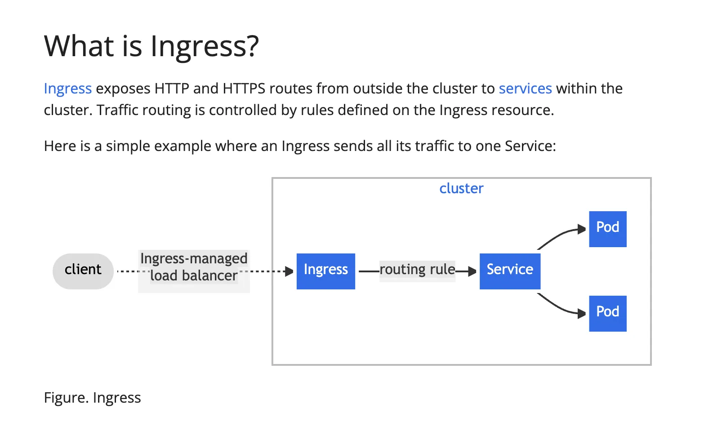

# Downsides of Kubernetes Services (Simple)
ClusterIP → Not accessible from outside the cluster
NodePort → Uses high ports, less secure, messy to manage
LoadBalancer → Can be expensive, creates one public IP per service
Limited routing → Services alone cannot do path-based routing like /api or /auth
Needs Ingress for real apps → For clean URLs and better traffic control, Services must be combined with Ingress
Creating multiple certificates for every route(service).
No centralized logic to handle rate limitting to all services
Each load balancer can have its own set of rate limits, but you cant create a single rate limitter for all your services. 

# ingress --> a seprate package  need to bring in nodes
An API object that manages external access to the services in a cluster, typically HTTP.
Ingress may provide load balancing, SSL termination and name-based virtual hosting.
 

What it is:
Ingress is like a smart traffic manager for your Kubernetes cluster.
Why it’s needed:
Without Ingress:
Each Service needs its own public IP (LoadBalancer)
With Ingress:
You can use one public IP for many services
Example
Instead of:
frontend → 1 IP  
backend  → 1 IP  
auth     → 1 IP  

With Ingress:
example.com        → frontend  
example.com/api    → backend  
example.com/auth   → auth  

Simple analogy:
Ingress = Receptionist of an office
Visitors come to one desk
Receptionist sends them to correct room

# namespace 
Imagine you have ONE big box 📦
That box is your Kubernetes cluster.
Inside the box you keep many things:
frontend
backend
database
cache
jobs
configs
Now the box becomes messy.
Namespace = smaller boxes inside the big box 📦📦📦
So instead of:
one big messy box

You create:
one box for practice
one box for project
one box for production
Example:
Big Box (Cluster)
 ├── Box 1: dev
 │    ├── frontend
 │    └── backend
 ├── Box 2: test
 │    ├── frontend
 │    └── backend
 └── Box 3: prod
      ├── frontend
      └── backend
Nothing technical changes
Important point:
Namespaces do NOT change how pods run.
Namespaces do NOT give extra power.
Namespaces ONLY help with organization and separation.

Why you actually need it
Without namespace:
You create:
kubectl create deployment backend
kubectl create deployment backend
Second one fails:
name already exists

With namespace:
kubectl create deployment backend -n dev
kubectl create deployment backend -n prod

Both work. No conflict.
One-line definition (ultra simple)
Namespace is just a way to separate things with the same name inside one cluster.

Ingress vs Ingress Controller (super simple)
# Ingress
Ingress is just a set of rules.
Think of it like:
A map that says
“If user goes to /api, send them to backend”
“If user goes to /auth, send them to auth-service”

Example Ingress rule:
apiVersion: networking.k8s.io/v1
kind: Ingress
But by itself:
Ingress does nothing.

# Ingress Controller
Ingress Controller is the actual software that reads the Ingress rules and makes them work.
Examples:
Nginx Ingress Controller
Traefik
HAProxy
AWS ALB Controller

# It:
Watches Ingress objects
Configures routing
Handles real traffic
Acts like the receptionist
# Super simple analogy
Thing	Real world analogy
Ingress	A route map 🗺️
Ingress Controller	A GPS driver 🚗
Map alone doesn't move anyone.
Driver reads map and actually drives.
# Without Ingress Controller
You can create 100 Ingress objects.
Nothing will work.
With Ingress Controller
# Traffic works:
Internet → LoadBalancer → Ingress Controller → Services → Pods
One-line interview answer
Ingress defines routing rules, while the Ingress Controller is the component that actually implements and enforces those rules.