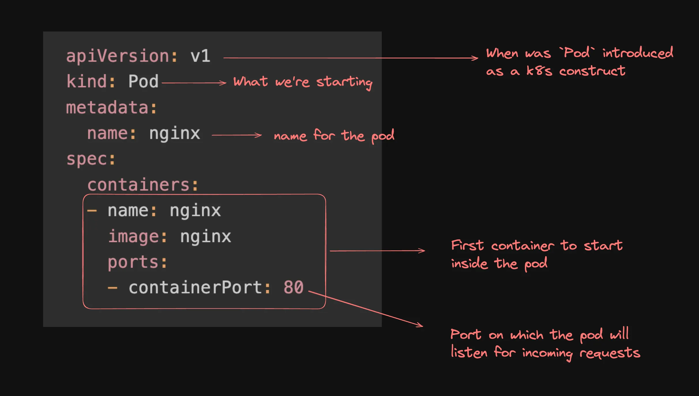

note:
# cluster.yml (or cluster config file)
This is used to create the Kubernetes cluster itself.
# It defines:
Control plane (master node),Worker nodes,Node sizes,Networking,Kubernetes version
# Manifest file (deployment.yaml, pod.yaml, service.yaml)
A manifest file is used to create objects inside Kubernetes, such as:
Pod,Deployment,Service,ConfigMap,Secret,Ingess,etc.

main benfits of having k8's is cloud agnostic

# tool to use k8's is kind(k8's inside docker)

# command to create cluster
kind create cluster --name local
# command to create cluster using congif.yml
kind create cluster --config clusters.yml --name local2
# command to delete cluster
kind delete cluster --name local
# cat ~/.kube/config  is used to check the credentails 

# kubectl is a command to used to send requests for api request by configuring the credentials which were ~/.kube/config
# kubectl which will be interacted with control plane(master node) to required operationd for tha pod

# kubectl is cli that automatically pics the credtianlf from ~./kube/config and send the desired reuests.

first u need to install kubectl 
1.kubectl get nodes -->fetch the nodes what all are present.
2.if u want to see what http requests were going on from kubectl
# kubectl get nodes --v=8
--->checking the verbosity this how talktive it was.
kubectl get pods -->used to get all pods.

# to create a pod
kubetctl run nginx --image=nginx --port=80

# note point 
You cannot create an empty Pod first and then “add a container later” into it.
And this is the key conceptual difference from Docker.
Why you can’t do that in Kubernetes
In Kubernetes:
A Pod must be created with its containers defined upfront.
So this idea is ❌ not possible:
Create empty pod
Later run nginx container inside it
Because:
Pods are immutable in structure
Once created, you cannot add/remove containers from an existing pod

# kubectl get pods -->used to check pods
kubectl get pods -o wide ---> used to checks pods only but in details like under which one node it created like that  

# command to delete pod ----> kubectl delete pod ingnix
#  command to check pod logs ----> kubectl  logs ingnix
# command to details of apod ----> kubectl describe pod ingnix 

the second option for creating pods is using the manigestfile(yml file)
todo --> manifesting

# kubernets manifest 
A manifest defines the desired state for Kubernetes resources, such as Pods, Deployments, Services, etc., in a declarative manner. 

kubectl run nginx --image=nginx --port=80 --> normal way

# same thing in manifest way

apiVersion: v1
kind: Pod
metadata:
  name: nginx
spec:
  containers:
  - name: nginx
    image: nginx
    ports:
    - containerPort: 
    
# kubectl apply -f manifest.  ---> command to apply manifest file after creating it.

#  kubectl delete pod nginx   ----> command to delete pod.

# Deployment
A Deployment in Kubernetes is a higher-level abstraction that manages a set of Pods and provides declarative updates to them. It offers features like scaling, rolling updates, and rollback capabilities, making it easier to manage the lifecycle of applications.
 

# What is a Deployment in Kubernetes?
A Deployment is a Kubernetes object that says:
“Run my application, keep it running, and manage updates for me.”
That’s it.
Why Deployment exists
# Pods can:
Crash
Get deleted
Stop suddenly
# A Deployment makes sure:
Your app is always running
If a pod dies → new pod is created
If you change app version → update happens safely

# Simple definition
Deployment = A controller that manages Pods for you

# Example in real life
Think of YouTube app:
You tell Kubernetes:
Run 3 copies of YouTube server

# So Deployment will:
Run 3 pods
If 1 pod crashes → creates new one
If you update code → replaces old pods slowly with new ones
You don’t control pods directly.
You control the Deployment.

# Very simple flow
You → create Deployment
Deployment → creates Pods
Pods → run your app
# One-line memory trick
Pod runs ap
Deployment runs Pods
# What Deployment actually does (only these 3 things)
Keeps required number of pods running
Restarts pods if they fail
Updates pods safely when app changes
Nothing more.

# Key Differences Between Deployment and Pod:
# Abstraction Level:
Pod: A Pod is the smallest and simplest Kubernetes object. It represents a single instance of a running process in your cluster, typically containing one or more containers.
Deployment: A Deployment is a higher-level controller that manages a set of identical Pods. It ensures the desired number of Pods are running and provides declarative updates to the Pods it manages.
# Management:
Pod: They are ephemeral, meaning they can be created and destroyed frequently.
Deployment: Deployments manage Pods by ensuring the specified number of replicas are running at any given time. If a Pod fails, the Deployment controller replaces it automatically.
# Updates:
Pod: Directly updating a Pod requires manual intervention and can lead to downtime.
Deployment: Supports rolling updates, allowing you to update the Pod template (e.g., new container image) and roll out changes gradually. If something goes wrong, you can roll back to a previous version.
# Scaling:
Pod: Scaling Pods manually involves creating or deleting individual Pods.
Deployment: Allows easy scaling by specifying the desired number of replicas. The Deployment controller adjusts the number of Pods automatically.
# Self-Healing:
Pod: If a Pod crashes, it needs to be restarted manually unless managed by a higher-level controller like a # # # # Deployment.
Deployment: Automatically replaces failed Pods, ensuring the desired state is maintained.

# 1. What are Replicas?
A replica means:
One copy of your app running (one Pod)
So:
1 replica = 1 pod
3 replicas = 3 pods

Example:
replicas: 3
Means:
"Kubernetes, always keep 3 pods running."
If one pod dies → Kubernetes creates a new one → still 3 pods.

2. What is a ReplicaSet?
A ReplicaSet is the thing that actually manages replicas (pods).

# Simple definition:
ReplicaSet = Controller that makes sure correct number of pods are running

# Relationship (important)
You → create Deployment
Deployment → creates ReplicaSet
ReplicaSet → creates Pods (replicas)

# You usually don’t create ReplicaSet directly.
Deployment handles it for you.
Real life example (super clear)
Pizza shop example:
Pod = One delivery boy

# Replica = One delivery boy
# ReplicaSet = Supervisor who ensures:

"There must always be 5 delivery boys working"
If one leaves → supervisor hires a new one.
What ReplicaSet actually does (only one job)

# Its only job:
Keep the number of pods equal to the replicas count.
Nothing else.
If you set:
replicas: 2

ReplicaSet ensures:
Always 2 pods running
If 1 crashes → creates 1 new
If you delete 1 manually → it recreates

# Difference between Replicas and ReplicaSet
Term	      Meaning
Replica	      One copy of pod
Replicas	  Number of pod copies
ReplicaSet	  The controller that maintains that number

# Deployment
* starting pods
* rolling them back  --> increasing or decreasing pods.
* updating pods      -->  changes to the newer version like nginx -->ngnix latest. 
* brinning them backup ---> if our latest version nginx2 fails then it will back 2 nginx1

# deployment --> creates replicaset ---> creates pods

# if replicat set creating pods then you do u need deployment
You need Deployment because ReplicaSet alone is not safe for updates and real production use.
ReplicaSet only keeps pods running.
Deployment handles updates, rollbacks, versions, and safety.