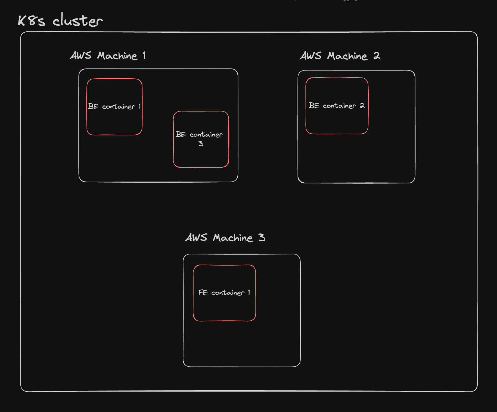
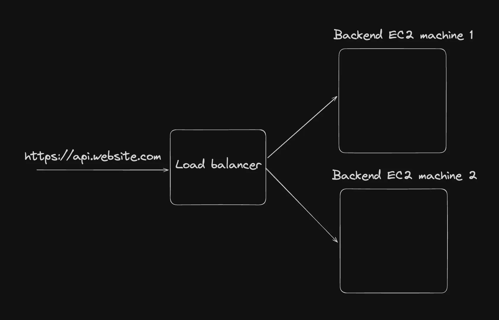
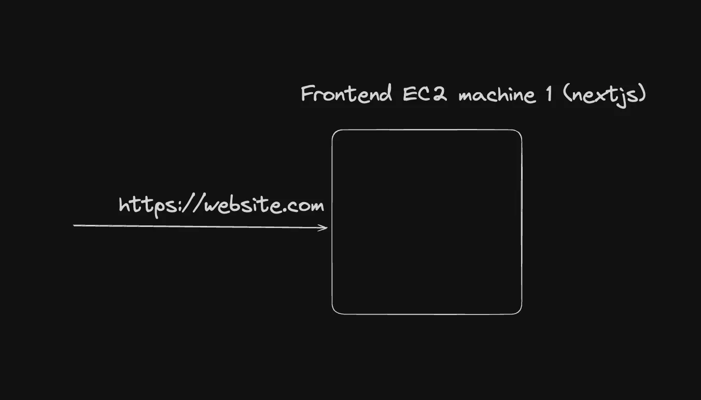
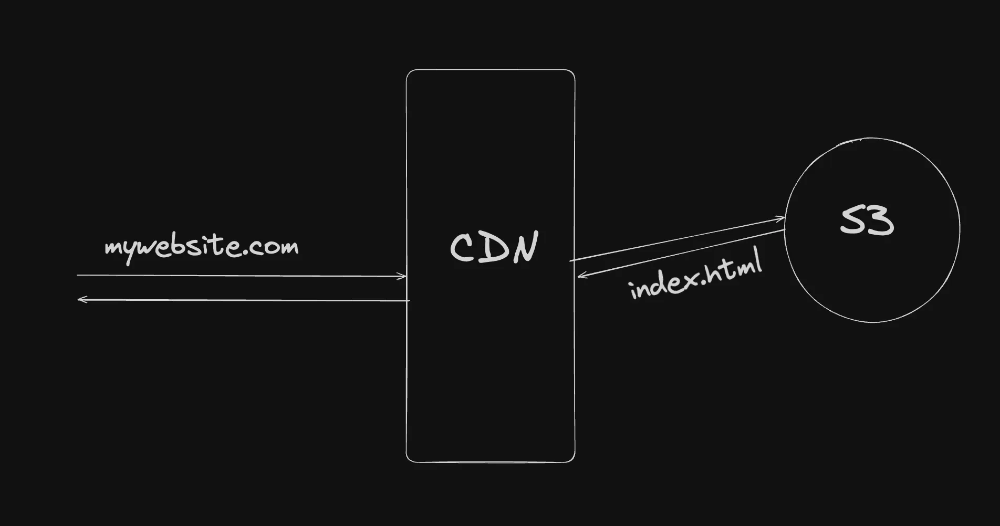
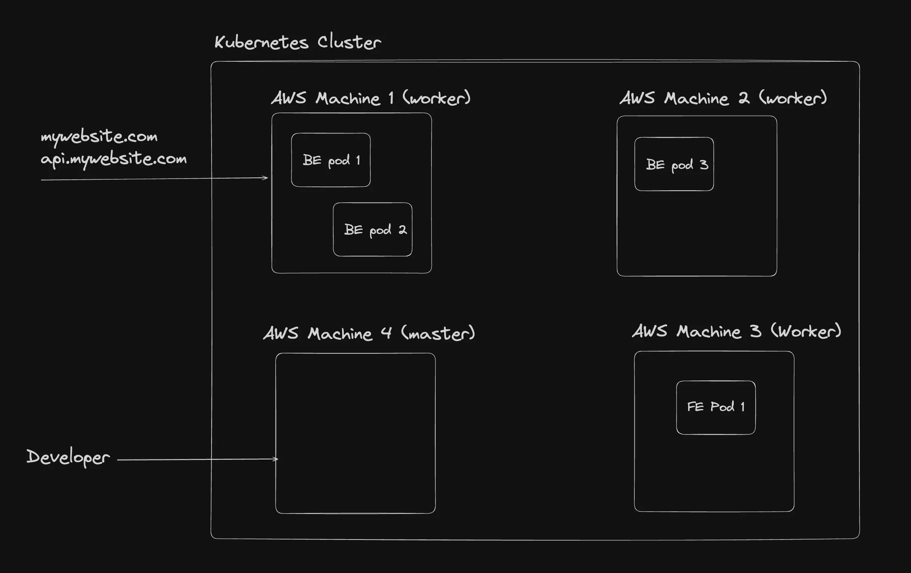
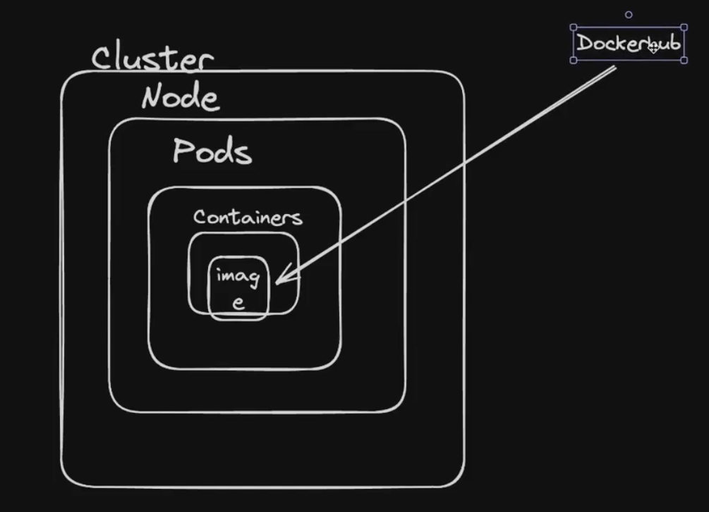
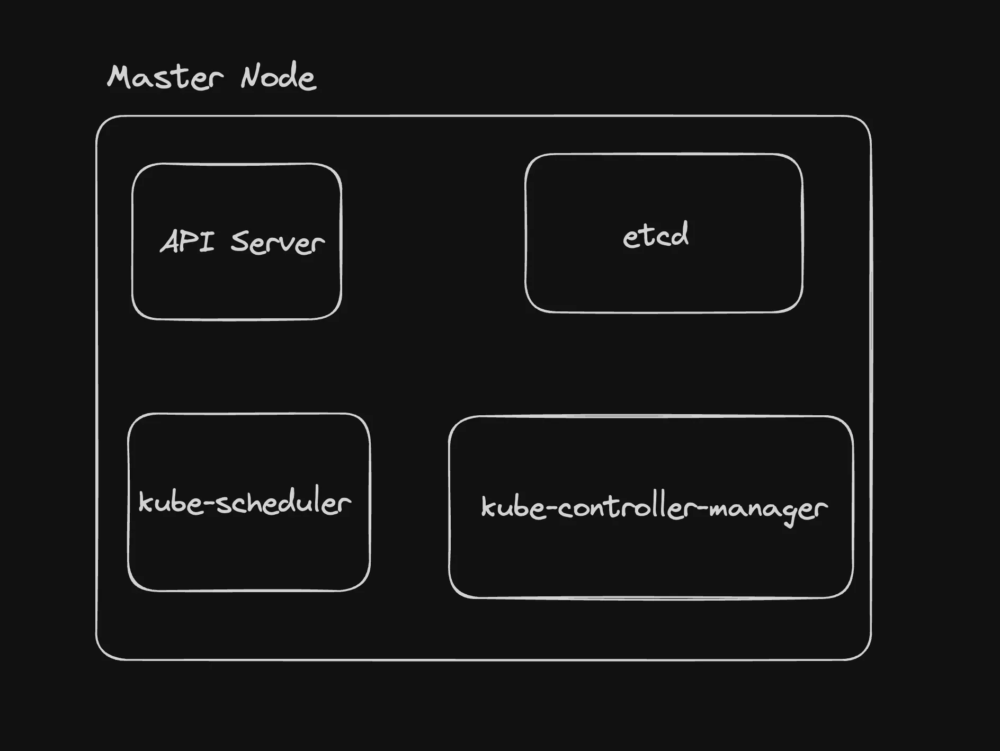

# Container Orcchestration : 
A container orchestrator is a system that manages containers automatically(create,delete,update containers).
It does things like:
Start containers
Stop containers
Restart if they crash
Scale up / scale down
Handle networking & load balancing

# This is useful when
You have your docker images in the docker registry and want to deploy it in a cloud native fashion
You want to not worry about patching, crashes. You want the system to auto heal
You want to autoscale with some simple constructs
You want to observe your complete system in a simple dashboard
 

# cluster :
a bunch of machines.


# before k8's 






# after k8's


while starting k8's there were 2 modes
1.worker nodes---> is a an ec2 machine like that (where the pod runs)
2.master nodes(Control pane) --> listen's to devolper and working according to his words.(this is also an ec2)
# here you don't need to ssh into the machine and start it manully.

# pod:
A Pod is the smallest unit in Kubernetes that runs containers together.
Pod = a wrapper around one or more containers

You usually run:
1 container in 1 pod
Sometimes multiple containers if they must work together

Why not run containers directly? 🤔
Kubernetes does not manage containers directly
It manages pods
So:
Container runs inside a pod
Pod is what Kubernetes creates, deletes, and manages

# Simple Example 📦
Think of:
Container = app (Node.js, Java, etc.)
Pod = box that holds the app
Pod
 └── Container (your app)
 Pod with Multiple Containers (Sidecar idea)
Sometimes:
One container = main app
Another container = helper (logging, proxy)

# Both:
Share same:
IP address
Storage
Network
Pod
 ├── App Container
 └── Helper Container

# Real-Life Analogy 🛺
Container = passenger
Pod = auto rickshaw
Auto (pod) moves passengers together.

# Important Points (Easy)
Pod has one IP
Containers inside pod can talk via localhost
Pod can be created and destroyed
Pods are not permanent
A pod is the smallest unit in Kubernetes that runs one or more containers together.

# note 
Kubernetes Cluster
 └── Node (EC2 machine / VM / physical server)
      └── Pod
           └── Container(s)
                |___images
👉 Pod is just a wrapper
👉 Container is where your actual application runs
You cannot run an app in a pod without a container.

# note :
But Kubernetes does NOT manage containers directly
That’s why pods exist.

# Why Kubernetes does NOT do this ❌
Kubernetes is a big system that needs:
Networking
Scaling
Restarting
Scheduling
Health checks
Doing this per container would be messy.
So Kubernetes says:
“I will manage pods, not containers.”

# Why not only containers? (Core reason)

If Kubernetes managed containers directly:
Each container would need:
Its own IP
Its own network rules
Its own scaling logic
This becomes complex and inefficient.
Pod groups things neatly.

# Real-Life Analogy 
Cooking at home → cook directly (Docker)
Restaurant chain → needs kitchen + rules (Kubernetes)
Pod = kitchen setup
Container = cook



# Nodes :


# Master Node (Control pane) 
- The node that takes care of deploying the containers/healing them/listening to the developer to understand what to deploy
it contains 
- api server
- etcd
- kube-scheduler.
- kube-controller.


# api servers
# 1.Handling RESTful API Requests: 
The API server processes and responds to RESTful API requests from various clients, including the kubectl command-line tool, other Kubernetes components, and external applications. These requests involve creating, reading, updating, and deleting Kubernetes resources such as pods, services, and deployments

# 2.Authentication and Authorization:
The API server authenticates and authorizes all API requests. It ensures that only authenticated and authorized users or components can perform actions on the cluster. This involves validating user credentials and checking access control policies.

# 3 Metrics and Health Checks: 
The API server exposes metrics and health check endpoints that can be used for monitoring and diagnosing the health and performance of the control plane(master node).

# 4.Communication Hub:
The API server acts as the central communication hub for the Kubernetes control plane. Other components, such as the scheduler, controller manager, and kubelet, interact with the API server to retrieve or update the state of the cluster.

# etcd ---> similar to reddis (ditributed key-value store)
Consistent and highly-available key value store used as Kubernetes' backing store for all cluster data. Ref - 
# etcd in Kubernetes (Very Simple Notes)

---

## 1. What is etcd?

👉 **etcd is the database of Kubernetes**
In very simple words:
> **etcd stores everything Kubernetes knows about the cluster**
It is the **source of truth** for Kubernetes.
---
## 2. Where is etcd used?
* etcd runs in the **Control Plane**
* Kubernetes control plane components **read from and write to etcd**
Without etcd, Kubernetes **cannot remember anything**.
---
## 3. What does etcd store?
etcd stores the **cluster state**, such as:
* Pods
* Nodes
* Deployments
* Services
* ConfigMaps
* Secrets
* Replica counts (e.g., 3 pods should run)
Example:
> "This app should always have 3 pods running" → stored in **etcd**
---
## 4. How etcd works (Simple Flow)
1. You run a command:
   ```bash
   kubectl apply -f deployment.yaml
   ```
2. Request goes to **API Server**
3. API Server **stores data in etcd**
4. Controllers read etcd and take action
   * Create pods
   * Restart failed pods
👉 etcd does **not run containers**, it only **stores data**
---
## 5. What type of database is etcd?
* Key–Value store
* Distributed
* Highly consistent
* Very fast
It is **not** like MySQL or PostgreSQL.
---
## 6. Why Kubernetes uses etcd?
Kubernetes needs:
* Fast read/write
* Strong consistency
* Reliable distributed storage
etcd is designed exactly for this purpose.
---
## 7. Real-Life Analogy
* Kubernetes = Manager
* etcd = Notebook / Brain
Manager writes:
> "Run 3 pods"
Notebook (etcd) **remembers it permanently**.
---
## 8. What happens if etcd goes down?
* Cluster cannot change state
* No new pods can be created
* No scaling or updates
* Existing pods may continue running
👉 That’s why etcd is **critical** and always **backed up**.
---
## 9. Important Points to Remember
* etcd is **mandatory** for Kubernetes
* It stores **desired state** and **current state**
* Control Plane depends on etcd
* Never expose etcd publicly
---
## Final Summary
* etcd = memory / brain of Kubernetes
* Stores all cluster information
* Control Plane reads and writes to it
* Without etcd → Kubernetes cannot work


# Kube scheduler
Control plane component that watches for newly created Pods with no assigned node, and selects a node for them to run on. Its responsible for pod placement and deciding which pod goes on which node.


# kube-scheduler in Kubernetes (Very Simple Notes)
## 1. What is kube-scheduler?
👉 **kube-scheduler decides where a Pod should run**
In simple words:
> **It selects the best Node (machine) for a Pod**
It is a **Control Plane component**.
## 2. Why kube-scheduler is needed?
In a cluster:
* There are **many Nodes (EC2 machines)**
* A new Pod is created
Question:
> "Which node should run this pod?"
👉 This decision is made by **kube-scheduler**.
## 3. What kube-scheduler does NOT do ❌
Very important:
* ❌ It does NOT create containers
* ❌ It does NOT run pods
* ❌ It does NOT pull images
It **only decides placement** (node selection).
## 4. How kube-scheduler works (Step-by-Step)
### Step 1: Pod definition is created
* You apply a YAML (Deployment / Pod)
* API Server **stores Pod information in etcd**
* Pod state = **Pending** (no node assigned)
### Step 2: kube-scheduler watches API Server
* kube-scheduler continuously watches the API Server
* It notices a **Pending Pod** (data comes from etcd)
### Step 3: Scheduler reads cluster state from etcd
* Through the API Server, scheduler knows:
  * Which nodes exist
  * Available CPU and memory
  * Node health
(All this cluster state is stored in **etcd**)
### Step 4: Node selection
* kube-scheduler filters nodes that **cannot** run the pod
* Scores remaining nodes
* Chooses the **best node**
### Step 5: Scheduler writes decision to etcd
* Selected node name is sent to API Server
* API Server **updates Pod info in etcd** (nodeName field)
### Step 6: kubelet runs the Pod
* kubelet on the chosen node watches API Server
* Sees the pod assigned to it
* Pulls image and starts containers
etcd is involved **before scheduling, during decision making, and after scheduling**.
## 5. EXACT FLOW (API Server ↔ etcd ↔ Scheduler ↔ kubelet)
Below is the **exact, real Kubernetes flow** in correct order:
### Step 1: User request
* `kubectl apply -f pod.yaml`
* `kubectl` → **API Server**
### Step 2: API Server writes to etcd
* API Server validates the request
* Stores Pod object in **etcd**
* Pod has:
  * `nodeName: null`
  * `status: Pending`
Flow:
API Server → etcd (WRITE)
### Step 3: kube-scheduler watches API Server
* kube-scheduler continuously **watches API Server**
* API Server reads Pod info from **etcd**
* Scheduler sees a **Pending Pod**
Flow:
kube-scheduler → API Server → etcd (READ)
### Step 4: Scheduler reads cluster state
* Scheduler asks API Server for:
  * Node list
  * CPU & memory
  * Node health
* API Server fetches this data from **etcd**
Flow:
kube-scheduler → API Server → etcd → API Server → kube-scheduler
---
### Step 5: Scheduler selects a node
* Filters nodes (who CAN run the pod)
* Scores nodes (who is BEST)
* Chooses one node (example: `node-2`)
(No etcd write here — decision in memory)
---
### Step 6: Scheduler writes decision
* Scheduler tells API Server:
  > Assign Pod to node-2
* API Server updates Pod object
* Writes updated Pod to **etcd**
Flow:
kube-scheduler → API Server → etcd (WRITE)
### Step 7: kubelet starts the Pod
* kubelet on `node-2` watches API Server
* API Server reads Pod assignment from **etcd**
* kubelet sees Pod is assigned to it
* kubelet pulls image and starts containers
Flow:
kubelet → API Server → etcd (READ)
---
### Final Result
* Pod is running on selected node
* etcd contains the **latest cluster state**
---

### One-Line Summary
> **API Server is the only component that talks to etcd; scheduler and kubelet always go through the API Server.**

```
Pod created
   ↓
API Server
   ↓
kube-scheduler
   ↓
Select Node
   ↓
Save to etcd
   ↓
Kubelet runs Pod
```
---
## 6. How kube-scheduler chooses a Node
### 1️⃣ Filtering (Who CAN run the pod?)
Nodes are removed if:
* Not enough CPU/RAM
* Node is down
* Node does not match requirements
### 2️⃣ Scoring (Who is BEST?)
Remaining nodes are scored based on:
* Least load
* Better resource availability
Node with **highest score** wins.
--
## 7. Things scheduler checks (Easy)
* CPU requests
* Memory requests
* Node selectors
* Taints and tolerations
* Pod affinity / anti-affinity
(Don’t worry if these sound advanced)
---
## 8. Real-Life Analogy 🏭
* Factory = Cluster
* Machines = Nodes
* Job = Pod
* Supervisor = kube-scheduler
Supervisor decides:
> "This job should go to Machine 3"
---
## 9. What happens if kube-scheduler goes down?
* Existing pods continue running ✅
* New pods **cannot be scheduled** ❌
That’s why control plane has **high availability**.
---
## 10. Important Points to Remember
* kube-scheduler runs in **control plane**
* One scheduler per cluster (usually)
* It watches API Server
* It works closely with etcd
---
## 11. One-Line Exam / Interview Answer
> **kube-scheduler is the Kubernetes control plane component that assigns pods to appropriate nodes based on resource availability and constraints.**
---
## Final Summary
* kube-scheduler = decision maker
* Chooses best node for a pod
* Does not run pods
* Writes decision to etcd
* Very critical for cluster operation

# kube-controller-manager in Kubernetes (Very Simple Notes)
The kube-controller-manager is a component of the Kubernetes control plane that runs a set of controllers. Each controller is responsible for managing a specific aspect of the cluster's state.
There are many different types of controllers. Some examples of them are:
# Node controller:
Responsible for noticing and responding when nodes go down.
# Deployment controller:  
Watches for newly created or updated deployments and manages the creation and updating of ReplicaSets based on the deployment specifications. It ensures that the desired state of the deployment is maintained by creating or scaling ReplicaSets as needed.
# ReplicaSet Controller: 
Watches for newly created or updated ReplicaSets and ensures that the desired number of pod replicas are running at any given time. It creates or deletes pods as necessary to maintain the specified number of replicas in the ReplicaSet's configuration.

## 1. What is kube-controller-manager?
👉 **kube-controller-manager is a control plane component that runs controllers**
In simple words:
> **It ensures the desired state of the cluster matches the actual state.**
---
## 2. Why is it needed?
* Pods can crash
* Nodes can go down
* Replicas may not match desired counts
Controllers watch cluster state and **fix problems automatically**, often involving the scheduler if new pods need placement.
---

## 3. Controllers it runs
Some important controllers:
* **Replication Controller / ReplicaSet Controller**: Ensures correct number of pod replicas
* **Deployment Controller**: Handles rolling updates
* **Node Controller**: Watches node health
* **Job Controller**: Ensures jobs complete successfully
* **Endpoints Controller**: Populates service endpoints
* **Service Account & Token Controllers**: Manages service accounts and tokens
---

## 4. How kube-controller-manager works (Step-by-Step with Scheduler)
### Step 1: Watches API Server
* Controllers continuously watch **API Server** for cluster state
* All state comes from **etcd** via API Server
### Step 2: Compares desired vs actual state
* Desired state = spec in YAML (stored in etcd)
* Actual state = current cluster state (from API Server / kubelet updates)
### Step 3: Takes action to fix differences
* Example 1: A Pod fails
  1. Controller sees desired replica count is not met
  2. Creates a new Pod object **without node assignment** → writes it to API Server → stored in etcd
  3. This triggers **kube-scheduler** to assign the Pod to an appropriate node
* Example 2: Node is down
  1. Controller sees Pods scheduled on that node are not running
  2. Creates replacement Pod objects → scheduler assigns them to healthy nodes
### Step 4: Updates API Server / etcd
* Controller writes any changes to **API Server** → updated Pod objects saved in **etcd**
* kubelet on assigned nodes sees updates → starts new Pods
---
## 5. Real-Life Analogy 🏭
* Cluster = factory
* Controllers = supervisors
* Scheduler = manager who assigns tasks to machines
* Goal = make sure factory always produces desired output
* If a worker (pod) is missing or machine (node) fails → supervisor creates new task → manager assigns it → task gets done
---
## 6. Important Points to Remember
* Runs as a **single binary but multiple controllers inside**
* **Watches API Server** (not etcd directly)
* Ensures **desired state = actual state**
* Works closely with **etcd** through API Server
* Works **together with kube-scheduler** when Pods need placement
---
## 7. One-Line Exam / Interview Answer
> **kube-controller-manager is the Kubernetes control plane component that runs controllers to ensure the cluster’s actual state matches the desired state, often coordinating with the scheduler to place new pods.**
---

## 8. Complete Workflow Example (Pod Replacement)
1. Existing Pod crashes
2. ReplicaSet Controller sees replica count < desired
3. Controller creates new Pod object (no node assigned) → writes to API Server → stored in **etcd**
4. **kube-scheduler** notices Pending Pod → selects node → updates Pod assignment in API Server → stored in **etcd**
5. kubelet on assigned node sees Pod → pulls image → starts containers
6. Desired replica count restored, cluster state matches desired state

---
### Key Takeaway
 Controllers and scheduler **work together**: Controller detects discrepancies and requests new Pods, Scheduler assigns them to nodes, API Server + etcd stores state, kubelets run Pods.


# worker node

1️⃣ Kubelet
What it is: Node agent
Runs where: Worker Node
Job: Talks to API Server and ensures the pods scheduled on that node are running properly
Key Point: Kubelet does not schedule pods; it enforces what the scheduler decided

2️⃣ Container Runtime
What it is: Software that runs containers (e.g., Docker, containerd, CRI-O)
Runs where: Worker Node
Job: Pulls container images, starts and stops containers, manages container lifecycle
Key Point: Container runtime actually runs your applications inside pods

3️⃣ Kube-Proxy
What it is: Network proxy and load balancer
Runs where: Worker Node
Job: Maintains network rules so pods can communicate with each other and with services; handles service discovery and routing
Key Point: Kube-proxy ensures network traffic reaches the correct pods

