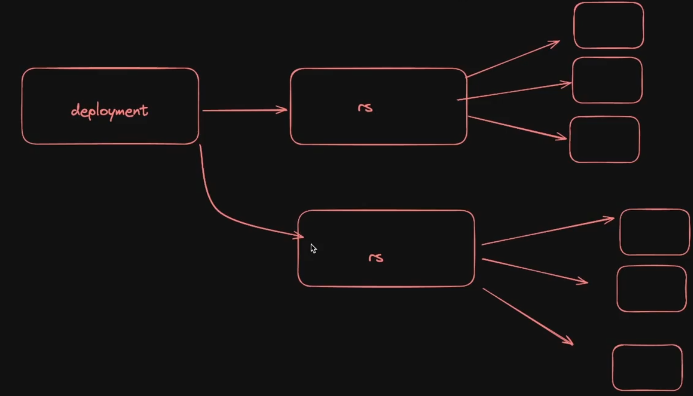
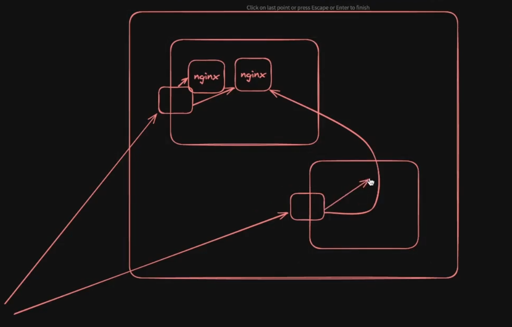
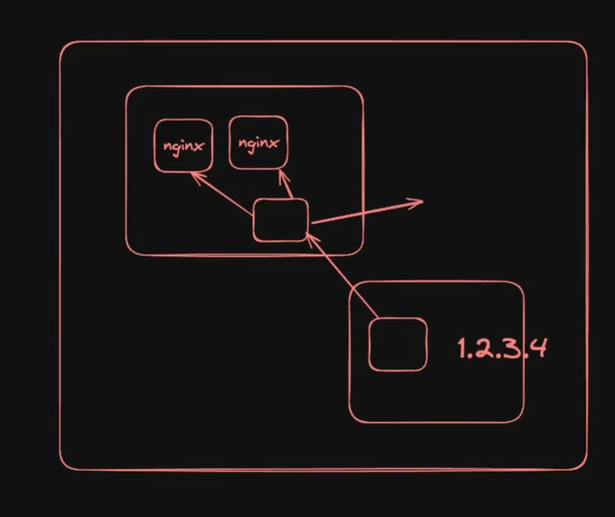

# Replicaset
ReplicaSet ensures the required number of pods are always running.

# Deployment
Deployment manages ReplicaSets and handles updates safely.

| Feature                    | ReplicaSet | Deployment |
| -------------------------- | ---------- | ---------- |
| Keeps pod count            | ✅ Yes      | ✅ Yes      |
| Creates Pods               | ✅ Yes      | ✅ Yes      |
| Handles rolling updates    | ❌ No       | ✅ Yes      |
| Supports rollback          | ❌ No       | ✅ Yes      |
| Version history            | ❌ No       | ✅ Yes      |
| Used directly in real apps | ❌ Rarely   | ✅ Always   |

let's say u tried to configue by updating you nginx to nginx2 image.
they it will create a new replicaset for them and then chekcing all pods and it;s selt healty or not 
and then after it will stop the old replicaset.

let's say u tried to configue by updating you nginx to nginx2 image.
they it will create a new replicaset for them and then chekcing all pods and it;s selt healty or not 
and then after it will stop the old replicaset.

i know that is is right 

but let's say  replicaset contains 3 pods

how internally will it work
if 1 pod nginx2 created and healthy in one replicaset 
and will it remove 1 pod nginx from other replicaset or 

will only remove the replicatset after it created all the 3 nginx 2 pods

# answer.
Scenario:
You update image from nginx → nginx2 in a Deployment
Old ReplicaSet has 3 pods
New ReplicaSet will be created

# The real behavior depends on RollingUpdate strategy, which is the default.
Short answer first
Kubernetes does NOT wait to create all 3 new pods first.
It does gradual replacement:
Create 1 new pod → delete 1 old pod → repeat.

# So the update happens step by step, not all at once.

Default rolling update behavior
By default, Deployment uses:
maxSurge: 25%
maxUnavailable: 25%
With 3 pods, this usually means:
It can create 1 extra new pod
It can delete 1 old pod at a time

What actually happens internally (step-by-step)

# Initial state:
Old ReplicaSet (nginx v1): 3 pods running
New ReplicaSet (nginx2):   0 pods

Step 1

# Create 1 new pod (nginx2)
Old: 3 pods  
New: 1 pod (healthy)
Total: 4 pods temporarily

Step 2

# Delete 1 old pod (nginx v1)
Old: 2 pods  
New: 1 pod
Total: 3 pods

Step 3
# Create another new pod
Old: 2  
New: 2 (both healthy)
Total: 4

Step 4
# Delete another old pod
Old: 1  
New: 2
Total: 3

Step 5
# Create third new pod
Old: 1  
New: 3
Total: 4

Step 6
# Delete final old pod
Old: 0  
New: 3
Total: 3

# Important point
Kubernetes waits for the new pod to become healthy
before deleting the old pod.
This ensures:
✅ No downtime
✅ App always available
✅ Safe rollou

# note : if something is wrong from nginx2 then it will make sure to rollback to nginx

Outside User (Browser / App)
        |
        |  http://localhost:30008
        v
+------------------------------------------------------------------+
|                         Kubernetes Cluster                       |
|                                                                  |
|  +---------------------- Control Plane ----------------------+   |
|  |                                                             |   |
|  |  API Server   ← receives kubectl commands                    |   |
|  |  Scheduler    ← decides which node runs which pod            |   |
|  |  Controller   ← ensures desired state (replicas, etc.)       |   |
|  |  etcd         ← stores cluster data (all configs, states)     |   |
|  +-------------------------------------------------------------+   |
|                                                                  |
|                                                                  |
|  +----------------------------- Service -----------------------+ |
|  |   (NodePort / ClusterIP / LoadBalancer)                      | |
|  |   Routes traffic to correct Pods using labels                | |
|  +--------------------------+----------------------------------+ |
|                             |                                    |
|                             v                                    |
|                       +------------ Deployment ------------+     |
|                       | manages updates and versions        |     |
|                       +------------+------------------------+     |
|                                    |                              |
|                                    v                              |
|                              +----------- ReplicaSet --------+    |
|                              | ensures correct pod count      |    |
|                              +-----+--------+--------+--------+    |
|                                    |        |        |             |
|                                    v        v        v             |
|                                  Pod      Pod      Pod              |
|                              +---------+ +---------+ +---------+    |
|                              |Container| |Container| |Container|    |
|                              |  nginx  | |  nginx  | |  nginx  |    |
|                              +---------+ +---------+ +---------+    |
|                                                                  |
|                                                                  |
|   These Pods run physically on Worker Nodes                      |
|                                                                  |
|   +------------------+        +------------------+              |
|   | Worker Node 1     |        | Worker Node 2     |              |
|   | Pod + Container    |        | Pod + Container    |              |
|   | kubelet, kube-proxy|        | kubelet, kube-proxy|              |
|   +------------------+        +------------------+              |
|                                                                  |
+------------------------------------------------------------------+

                   USER (browser / app)
                           |
                           v
                        SERVICE
                     (exposes app)
                           |
                           v
                          POD
                      (runs app)
                           ^
                           |
                       REPLICASET
                   (keeps pod count)
                           ^
                           |
                       DEPLOYMENT
                    (handles updates)

# service is a process which works prallely with deployment (don't bother about their fn's)

# What is a Service? (super simple)
A Service is a stable address that lets you talk to your Pods.
# Pods:
Have IP addresses
But those IPs change when pods restart
So Kubernetes gives you a Service:
One fixed name/IP
That always forwards traffic to the correct Pods
# Why do we need Service?
Without Service:
Pod dies → new Pod → new IP
Your app breaks ❌

# With Service:
Pod changes → Service stays same
Your app keeps working ✅
# How Service works (no complexity)
You write:
selector:
  app: nginx

# Kubernetes understands:
Any Pod with label app: nginx → send traffic to them.
Service is just a traffic router.

# Simple real-world example

Imagine 3 doctors (Pods) in a hospital.
Patients don’t go to doctors directly.
They go to Reception (Service).

Reception:
Has one phone number
Sends patients to any available doctor

If one doctor leaves → new doctor joins
Reception still works the same.

| Type         | Meaning                     |
| ------------ | --------------------------- |
| ClusterIP    | Only inside cluster         |
| NodePort     | Accessible from your laptop |
| LoadBalancer | Public internet             |
| Ingress      | Smart routing (advanced)    |

the below shows the node port

the below shows the clusterIp port

apiVersion: v1
kind: Service
metadata:
  name: nginx-service
spec:
  selector:
    app: nginx
  ports:
    - protocol: TCP
      port: 80
      targetPort: 80
      nodePort: 30007  # This port can be any valid port within the NodePort range
  type: NodePort

  # that 30007:80  --> machine(workernode) to container(nginx)
  # this means that 30007 is not exposing your pc 
  # it is exposing your worker nodes/machines.

#  What is a LoadBalancer Service? (very simple)
A LoadBalancer Service gives your app a public IP address so anyone on the internet can access it.

Why do we need LoadBalancer when we already have NodePort?

NodePort problem:

You must use:

http://<node-ip>:30007

* If node dies → IP changes
* If many nodes → which IP do you use?
* Not professional for real users
* LoadBalancer solves this by giving:
* One stable public IP
* One clean port (usually 80 / 443)

You no longer care about:
Node IP
NodePort
Which node is alive

# it does provide u to do things outside the k8's as well
# beacuse of this u nill never expose core meta data of your nodes.